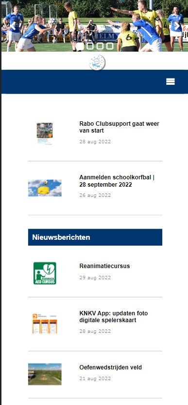
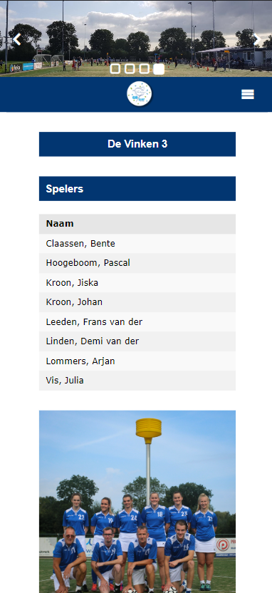
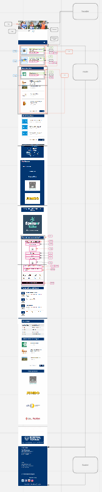
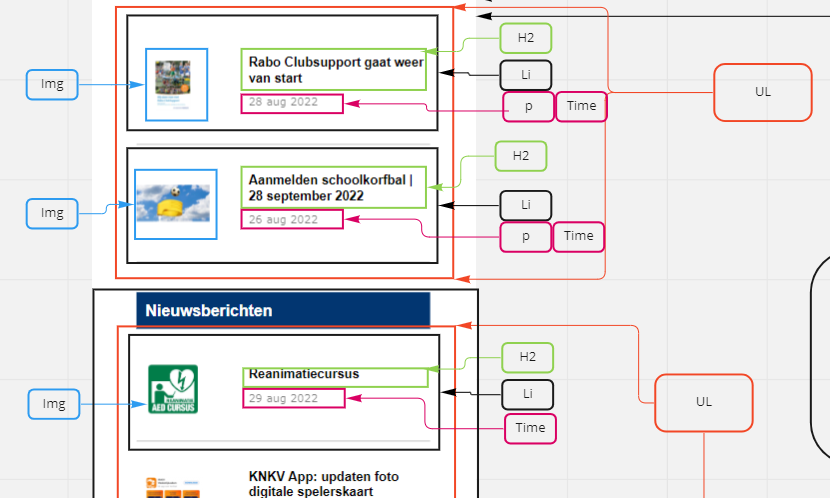
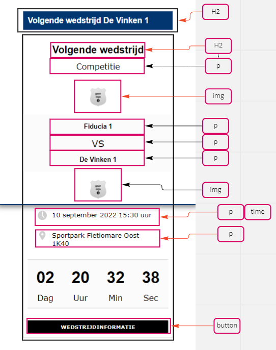

# Procesverslag
Markdown is een simpele manier om HTML te schrijven.  
Markdown cheat cheet: [Hulp bij het schrijven van Markdown](https://github.com/adam-p/markdown-here/wiki/Markdown-Cheatsheet).

Nb. De standaardstructuur en de spartaanse opmaak van de README.md zijn helemaal prima. Het gaat om de inhoud van je procesverslag. Besteedt de tijd voor pracht en praal aan je website.

Nb. Door *open* toe te voegen aan een *details* element kun je deze standaard open zetten. Fijn om dat steeds voor de relevante stuk(ken) te doen.

## Jij

  
uitwerken voor kick-off werkgroep

  ### Auteur:
  Julia Vis

  #### Je startniveau:
  Rood

  #### Je focus:
  Surface plane
 

## Je website

  
uitwerken voor kick-off werkgroep

  ### Je opdracht:
  https://www.de-vinken.nl/

  #### Screenshot(s) van de eerste pagina (small screen): 
  Home Pagina 
  

  #### Screenshot(s) van de tweede pagina (small screen):
  Team Pagina Vinken 3
  
 

## Toegankelijkheidstest 1/2 (week 1)

  
uitwerken na test in 1e werkgroep

  ### Bevindingen
  Lijst met je bevindingen die in de test naar voren kwamen:

  #### Screenreader
 De screenreader leest goed alle koppen voor. Een aantal images hebben alleen geen alt tekst om duidelijk te maken wat voor afbeelding het is. Zoals het logo en de slideshow boven aan de home pagina. Verder wordt er van elke kop vertelt welke kop dit precies is. Ook leest de screenreader de namen van de teamleden op de teampagina niet voor. De states worden ook niet voorgelezen door de screenreader. Dit is heel onhandig aangezien het menu boven aan de pagina alleen maar dropdown menu's bevat.

  #### Muis en Toetsenbord 
  De bediening met het toetsenbord gaat in principe prima. Alleen kun je in het menu boven in de dropdown menu's wel activeren maar wordt dit niet vertelt. De hover state wordt hier toegepast op de website. Op de telefoon gewoon meteen de active state. Ook kun je op de team pagina niet verder dan de eerste kop boven aan de pagina. Na het menu stopt het. 

  #### Motoriek (shocks, elastiekjes)
  Hier korte omschrijving (met indien nodig afbeeldingen)

  Hier een omschrijving van hoe het opgelost kan worden (met indien nodig afbeeldingen)

  #### Visueel (brillen, contrast, kleurenblind, dark/light). 
  De website van de vinken heeft op dit moment nog geen dark/light mode. Verder is de website wel goed te lezen door mensen die kleurenblind zijn. Dit komt door het heldere contrast tussen elementen op de pagina. 

## Breakdownschets (week 1)

  
uitwerken na afloop 2e werkgroep

  ### de hele pagina: 
  

  ### dynamisch deel (bijv menu): 
  

  ### wellicht nog een dynamisch deel (bijv filter): 
  

## Voortgang 1 (week 2)

  
uitwerken voor 1e voortgang

  ### Stand van zaken
  hier dit ging goed & dit was lastig (neem ook screenshots op van delen van je website en code)

  ### Agenda voor meeting
  samen met je groepje opstellen

  | Quinny en Julia: Hoe steekt de html in elkaar? Is de opbouw van de html goed? Zijn alle onderdelen goed genest.
  | Quinny: Hoe zet ik de basis op voor mijn hamburger menu?
  ### Verslag van meeting
  Tijdens de meeting waren alleen ik en Quinny er. We kregen feedback van de studentassistenten. We hebben gekeken naar de html van onze pagina's en of deze goed genest stonden. Sommige onderdelen waren nog niet helemaal goed genest en moesten aangepast worden. Zoals items die in een ul stonden maar geen li om zich heen hadden. En verder hebben we gekeken naar punten die ik zelf kon verbeteren aan de website. Zoals de hamburger menu button die niet van vorm veranderde. En de header carousel die niet goed responive is op de originele site.
  Verder hand Quinny nog een vraag over hoe ze het hamburgermenu het beste kon beginnen. Het antwoord op deze vraag was een unorderd list maken met de menu opties als list items

## Voortgang 2 (week 3)

  
uitwerken voor 2e voortgang

  ### Stand van zaken
  De Carousel maken is gelukt. Ik mis alleen nog de buttons die er voor zorgen dat je naar de volgende pagina kan, en de vierkantjes onderin waarmee je naar een foto kan navigeren. Verder heb ik een responsive navigatie menu gemaakt, die veranderd in een hamburger menu als het scherm kleiner wordt dan 51em. Ook is het gelukt om de nieuwsberichten vorm tegeven met grid. 

  ### Agenda voor meeting

  | Aron, Quinny, Britney, Julia 
  Hoe voeg je een dropdown menu toe aan een navigatiemenu.
  | Quinny
  Hoe maak je een drop down icoontje. Een pijltje naar beneden
  | Britney
  Hoe bepaal ik mijn H1? Ik zie hem namelijk niet.
  | Op suggestie van Sanne
  Hoe pas ik @media toe in een navigatie menu

  ### Verslag van meeting
    | Aron, Quinny, Britney, Julia 
  Hoe voeg je een dropdown menu toe aan een navigatiemenu.
  Sanne heeft samen met ons een navigatie menu gemaakt met een drow down functie. Deze heeft hij opgeslagen in codepen. Deze code ga ik ook nodig hebben voor mijn website
  https://codepen.io/shooft/pen/gOzGoww

  | Quinny
  Hoe maak je een drop down icoontje. Een pijltje naar beneden.
  Sanne heeft samen met ons een icoontje gemaakt. Ook heeft hij hier een draaid pijltje van gemaakt zodat als je het menu opent het pijltj omdraait. De code heeft hij in codepen gezet. 
https://codepen.io/shooft/pen/poVWpQQ

  | Britney
  Hoe bepaal ik mijn H1? Ik zie hem namelijk niet.

  Antwoord op de vraag: Deze is verborgen op de pagina. Wel zodanig dat de screenreader de h1 voorleest, zodat de gebruiker van de screenreader wel weet waar de pagina over gaat. Dit doen ze op de volgende manier.

  .visually-hidden {
  clip: rect(0 0 0 0);
  clip-path: inset(50%);
  height: 1px;
  overflow: hidden;
  position: absolute;
  white-space: nowrap;
  width: 1px;
}
Deze code ga ik ook nodig hebben voor mijn website

  | Op suggestie van Sanne
  Hoe pas ik @media toe in een navigatie menu
  @media heb ik al toegepast in mijn website. In het navigatiemenu. Sanne heeft de code van het navigatiemenu opgeslagen in codepen. Sanne is alleen vergeten om het menu weer in het scherm te zetten op het moment dat het scherm groter is dan 40em zag ik later. :-)
https://codepen.io/shooft/pen/YzLrEJo

## Toegankelijkheidstest 2/2 (week 4)

  
uitwerken na test in 8e werkgroep

  ### Bevindingen
  Lijst met je bevindingen die in de test naar voren kwamen (geef ook aan wat er verbeterd is):

  #### Screenreader
  Hier korte omschrijving (met indien nodig afbeeldingen)

  Hier een omschrijving van hoe het opgelost kan worden (met indien nodig afbeeldingen)

  #### Muis en Toetsenbord 
  Hier korte omschrijving (met indien nodig afbeeldingen)

  Hier een omschrijving van hoe het opgelost kan worden (met indien nodig afbeeldingen)

  #### Motoriek (shocks, elastiekjes)
  Hier korte omschrijving (met indien nodig afbeeldingen)

  Hier een omschrijving van hoe het opgelost kan worden (met indien nodig afbeeldingen)

  #### Visueel (brillen, contrast, kleurenblind, dark/light). 
  Hier korte omschrijving (met indien nodig afbeeldingen)

  Hier een omschrijving van hoe het opgelost kan worden (met indien nodig afbeeldingen)

## Voortgang 3 (week 4)

  
uitwerken voor 3e voortgang

  ### Stand van zaken
  hier dit ging goed & dit was lastig (neem ook screenshots op van delen van je website en code)

  ### Agenda voor meeting
  samen met je groepje opstellen

  | student 1      | student 2          | student 3    | student 4        |
  | ---            | ---                | ---          | ---              |
  | dit bespreken  | en dit             | en ik dit    | en dan ik dat    |
  | en dat ook nog | dit als er tijd is | nog een punt | dit wil ik zeker |
  | ...            | ...                | ...          | ...              |

  ### Verslag van meeting
  hier na afloop snel de uitkomsten van de meeting vastleggen

  - punt 1
  - punt 2
  - nog een punt
  - ...

## Eindgesprek (week 5)

  
uitwerken voor eindgesprek

  ### Je uitkomst - karakteristiek screenshots:
  

  ### Dit ging goed/Heb ik geleerd: 
  Korte omschrijving met plaatjes

  

  ### Dit was lastig/Is niet gelukt:
  Korte omschrijving met plaatjes

  

## Bronnenlijst

  
continu bijhouden terwijl je werkt

  Nb. Wees specifiek ('css-tricks' als bron is bijv. niet specifiek genoeg).

  1. Voor het verbergen van content 
  https://www.a11yproject.com/posts/how-to-hide-content/
  2. bron 2
  3. ...

