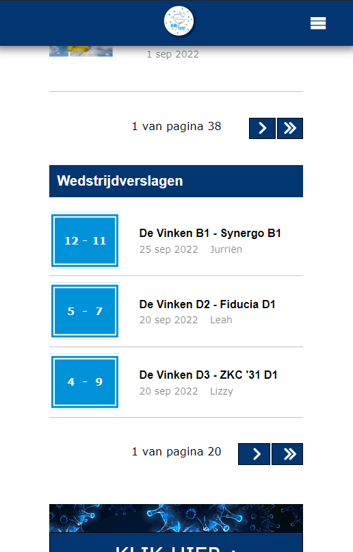
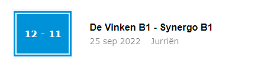

# Procesverslag
Markdown is een simpele manier om HTML te schrijven.  
Markdown cheat cheet: [Hulp bij het schrijven van Markdown](https://github.com/adam-p/markdown-here/wiki/Markdown-Cheatsheet).

Nb. De standaardstructuur en de spartaanse opmaak van de README.md zijn helemaal prima. Het gaat om de inhoud van je procesverslag. Besteedt de tijd voor pracht en praal aan je website.

Nb. Door *open* toe te voegen aan een *details* element kun je deze standaard open zetten. Fijn om dat steeds voor de relevante stuk(ken) te doen.

## Jij

  
uitwerken voor kick-off werkgroep

  ### Auteur:
  Julia Vis

  #### Je startniveau:
  Rood

  #### Je focus:
  Multi-device design
 

## Je website

  
uitwerken voor kick-off werkgroep

  ### Je opdracht:
  https://www.de-vinken.nl/

  #### Screenshot(s) van de eerste pagina (small screen): 
  Home Pagina 
  

  #### Screenshot(s) van de tweede pagina (small screen):
  Team Pagina Vinken 3
  
 

## Toegankelijkheidstest 1/2 (week 1)

  
uitwerken na test in 1e werkgroep

  ### Bevindingen
  Lijst met je bevindingen die in de test naar voren kwamen:

  #### Screenreader
 De screenreader leest goed alle koppen voor. Een aantal images hebben alleen geen alt tekst om duidelijk te maken wat voor afbeelding het is. Zoals het logo en de slideshow boven aan de home pagina. Verder wordt er van elke kop vertelt welke kop dit precies is. Ook leest de screenreader de namen van de teamleden op de teampagina niet voor. De states worden ook niet voorgelezen door de screenreader. Dit is heel onhandig aangezien het menu boven aan de pagina alleen maar dropdown menu's bevat.

  #### Muis en Toetsenbord 
  De bediening met het toetsenbord gaat in principe prima. Alleen kun je in het menu boven in de dropdown menu's wel activeren maar wordt dit niet vertelt. De hover state wordt hier toegepast op de website. Op de telefoon gewoon meteen de active state. Ook kun je op de team pagina niet verder dan de eerste kop boven aan de pagina. Na het menu stopt het. De website heeft geen focus. Je kunt als gerbuiker niet zien waar je op de pagina bent en wat gefocused is op de website. Dat is zeker een punt dat ik aan ga pakken.

  #### Motoriek (shocks, elastiekjes)
 De website is goed te bedienen met shocks. Alleen de knopjes om naar een volgende pagina te gaan zijn misschien wat klein. Je schiet snel uit met je muis. Door dat dit gebeurd klik je naast de knop.

  #### Visueel (brillen, contrast, kleurenblind, dark/light). 
  De website van de vinken heeft op dit moment nog geen dark/light mode. Verder is de website wel goed te lezen door mensen die kleurenblind zijn. Dit komt door het heldere contrast tussen elementen op de pagina. Bij de bril waar het rechter deel van de glazen is afgeschermd, was het lastig om de rechter kant van de volledige webpagina te lezen. Wel is een deel van de rechter pagina te zien waardoor de gebruiker weet dat er nog wat te zien is op het rechter deel van de pagina. En bij de bril central field loss is de pagina kun je alleen telkens het bovenste deel van de pagina lezen. 

## Breakdownschets (week 1)

  
uitwerken na afloop 2e werkgroep

  ### de hele pagina: 
  

  ### dynamisch deel (bijv menu): 
  

  ### wellicht nog een dynamisch deel (bijv filter): 
  

## Voortgang 1 (week 2)

  
uitwerken voor 1e voortgang

  ### Stand van zaken
  hier dit ging goed & dit was lastig (neem ook screenshots op van delen van je website en code)

  ### Agenda voor meeting
  samen met je groepje opstellen

  | Quinny en Julia: Hoe steekt de html in elkaar? Is de opbouw van de html goed? Zijn alle onderdelen goed genest.
  | Quinny: Hoe zet ik de basis op voor mijn hamburger menu?
  ### Verslag van meeting
  Tijdens de meeting waren alleen ik en Quinny er. We kregen feedback van de studentassistenten. We hebben gekeken naar de html van onze pagina's en of deze goed genest stonden. Sommige onderdelen waren nog niet helemaal goed genest en moesten aangepast worden. Zoals items die in een ul stonden maar geen li om zich heen hadden. En verder hebben we gekeken naar punten die ik zelf kon verbeteren aan de website. Zoals de hamburger menu button die niet van vorm veranderde. En de header carousel die niet goed responive is op de originele site.
  Verder hand Quinny nog een vraag over hoe ze het hamburgermenu het beste kon beginnen. Het antwoord op deze vraag was een unorderd list maken met de menu opties als list items

## Voortgang 2 (week 3)

  
uitwerken voor 2e voortgang

  ### Stand van zaken
  De Carousel maken is gelukt. Ik mis alleen nog de buttons die er voor zorgen dat je naar de volgende pagina kan, en de vierkantjes onderin waarmee je naar een foto kan navigeren. Verder heb ik een responsive navigatie menu gemaakt, die veranderd in een hamburger menu als het scherm kleiner wordt dan 51em. Ook is het gelukt om de nieuwsberichten vorm tegeven met grid. 

  ### Agenda voor meeting

  | Aron, Quinny, Britney, Julia 
  Hoe voeg je een dropdown menu toe aan een navigatiemenu.
  | Quinny
  Hoe maak je een drop down icoontje. Een pijltje naar beneden
  | Britney
  Hoe bepaal ik mijn H1? Ik zie hem namelijk niet.
  | Op suggestie van Sanne
  Hoe pas ik @media toe in een navigatie menu

  ### Verslag van meeting
    | Aron, Quinny, Britney, Julia 
  Hoe voeg je een dropdown menu toe aan een navigatiemenu.
  Sanne heeft samen met ons een navigatie menu gemaakt met een drow down functie. Deze heeft hij opgeslagen in codepen. Deze code ga ik ook nodig hebben voor mijn website
  https://codepen.io/shooft/pen/gOzGoww

  | Quinny
  Hoe maak je een drop down icoontje. Een pijltje naar beneden.
  Sanne heeft samen met ons een icoontje gemaakt. Ook heeft hij hier een draaid pijltje van gemaakt zodat als je het menu opent het pijltj omdraait. De code heeft hij in codepen gezet. 
https://codepen.io/shooft/pen/poVWpQQ

  | Britney
  Hoe bepaal ik mijn H1? Ik zie hem namelijk niet.

  Antwoord op de vraag: Deze is verborgen op de pagina. Wel zodanig dat de screenreader de h1 voorleest, zodat de gebruiker van de screenreader wel weet waar de pagina over gaat. Dit doen ze op de volgende manier.

  .visually-hidden {
  clip: rect(0 0 0 0);
  clip-path: inset(50%);
  height: 1px;
  overflow: hidden;
  position: absolute;
  white-space: nowrap;
  width: 1px;
}
Deze code ga ik ook nodig hebben voor mijn website

  | Op suggestie van Sanne
  Hoe pas ik @media toe in een navigatie menu
  @media heb ik al toegepast in mijn website. In het navigatiemenu. Sanne heeft de code van het navigatiemenu opgeslagen in codepen. Sanne is alleen vergeten om het menu weer in het scherm te zetten op het moment dat het scherm groter is dan 40em zag ik later. :-)
https://codepen.io/shooft/pen/YzLrEJo

## Toegankelijkheidstest 2/2 (week 4)

  
uitwerken na test in 8e werkgroep

  ### Bevindingen
  Lijst met je bevindingen die in de test naar voren kwamen:

  #### Screenreader
 De screenreader leest de datum's waarop het bericht geplaatst is, gewoon voor zonder te vertellen wat deze datum betekend. Het kan dus zo zijn dat in de kop een datum staat en dat daarna meteen de volgende datum wordt voorgelezen. Dit is heel verwarrend. Verder worden de uitslagen van de wedstrijden ook voorgelezen zonder context. De gebruiker heeft hier dus ook geen idee waarom deze getallen worden voorgelezen. Ook is het niet duidelijk welke teams tegen elkaar spelen. De teams worden zonder pauze voorgelezen. Dus bijvoorbeeld. De Vinken E1 SDO E1. Terwijl hij eigenlijk moet vertellen aan de gebruiker dat de teams tegen elkaar hebben gespeeld. Dus De Vinken E1 tegen SDO E1. Ook bij de sectie met informatie over de volgende wedstrijd van de Vinken 1 is het niet duidelijk om welk team het gaat. Om dit op te lossen heeft Sanne als tip gegeven een span om de tekst "tegen" te zetten en dan deze onzichtbaar te maken.

  #### Muis en Toetsenbord 
 Met het toetsenbord zijn alle interactieve delen van de website te bereiken. Alleen de twee kopjes in de navigatie: Wedstrijden en Agenda zijn niet te bereiken. Dit moet nog even aanpassen. Het zijn a elementen maar ze hebben nog geen href. Deze moeten nog toegevoegd worden. Verder worden er 2 secties volledig geskipt. De sectie verjaardagen en de sectie agenda. Opzich logisch want deze secties hebben geen interactieve elementen. Verder is de Focus slecht te zien en moet nog aangepast worden. Op de officiële website is er geen focus. Dus de focus mag ik zelf gaan ontwerpen. Hij is op dit moment nog zwart, maar dat is bij de blauwe buttons niet goed te zien. Ik denk dat ik of voor de licht blauwe kleur ga die ook gebruikt wordt bij de active state. Of licht groen die ook gebruikt wordt in het logo. Ook kun je als het scherm klein is het menu niet openvouwen met de tab knop. Ook wordt het menu niet gefocused. 

  #### Motoriek (shocks, elastiekjes)
 Mijn website is goed te bedienen wanneer een gerbuiker shocks heeft. Alleen ben ik vergeten de knopjes groter te maken. Dus deze zijn nog steeds te klein en moeten groter gemaakt worden.

  #### Visueel (brillen, contrast, kleurenblind, dark/light). 
  De brillen hadden hetzelfde effect als de vorige keer dat ik ging testen. Deze ervaring was hetzelfde op mijn eigen website. De dark mode ga ik nog toevoegen om deze toegankelijkheid te verbeteren.

## Voortgang 3 (week 4)

  
uitwerken voor 3e voortgang

  ### Stand van zaken
  hier dit ging goed & dit was lastig (neem ook screenshots op van delen van je website en code)

<!-- Afbeeldingen plaatsen -->
  ### Agenda voor meeting
  samen met je groepje opstellen

  |Julia: Buttons in carousel, hoe scroll ik daarmee naar de volgende afbeelding?
          Navigatie menu met drop downs werkt niet zoals het hoort. Waar heb ik een fout gemaakt. Navigatie met dropdown in responsive design
   Arron: Vragen over zijn navigatie menu en hoe hij dit voor zijn website goed kan krijgen. In dropdown vorm. Hij heeft deze met Sanne gemaakt maar weet niet hoe hij de juiste styling hieraan kan geven.
   Britney: - (Vragen werden persoonlijk aan de student assistent gesteld.)
   Quinny: -. (Vragen werden persoonlijk aan de student assistent gesteld.)
           
  ### Verslag van meeting
 Tijdens de meeting is er vooral per persoon gekeken naar wat er nodig was om iets goed te krijgen. Er was niet echt een algemeen moment. Alleen in het begin heel eventjes. Voor mij was het navigatie menu het grootste probleem en daar wilde ik graag hulp bij. De list items kwamen in een row te staan in plaats van in een column en ze bleven zichtbaar en verdwenen niet.

 De student assistenten kwamen mij persoonlijk helpen. En dit leverde wel wat op. Maar het menu werkte hierna helemaal niet meer. Na flink tijd gestoken te hebben in waar het precies fout ging, kwam Sanne mij nog even helpen met uitzoeken waar de fout zat. Het bleek zo te zijn dat ik de css van de navigatie voor het breedde scherm op de verkeerde plek had staan. Namelijk in het @media (min-width) gedeelte. Deze code moest ik dus even op de juiste plek zetten en dan de code voor de dropdown menu's toevoegen. Daarnaast had ik heel veel :nth-of-type(1) staan. Maar netter is het om first-of-type te gebruiken. Uiteindelijk om 17:45 ben ik toen naar huis gegaan. Terwijl mijn voortgangsgesprek om 14:40 ongeveer begon.

## Eindgesprek (week 5)

  
uitwerken voor eindgesprek

  ### Je uitkomst - karakteristiek screenshots:
  

  ### Dit ging goed/Heb ik geleerd: 
  Korte omschrijving met plaatjes

  

  ### Dit was lastig/Is niet gelukt:
  Korte omschrijving met plaatjes

  

## Bronnenlijst

  
continu bijhouden terwijl je werkt

  Nb. Wees specifiek ('css-tricks' als bron is bijv. niet specifiek genoeg).

  1. Voor het verbergen van content 
  https://www.a11yproject.com/posts/how-to-hide-content/

  .visually-hidden {
	clip: rect(0 0 0 0);
	clip-path: inset(50%);
	height: 1px;
	overflow: hidden;
	position: absolute;
	white-space: nowrap;
	width: 1px;
}
  2. Carousel scrollbar weghalen: https://codepen.io/shooft/pen/abmLRMg?editors=0110
  3. Om te kijken hoe ik de tijd in een time element moest noteren: https://developer.mozilla.org/en-US/docs/Web/HTML/Element/time
  4. Voor de opmaak van een alleen de onderkant van een border: /* https://developer.mozilla.org/en-US/docs/Web/CSS/border-bottom */
  5. 

